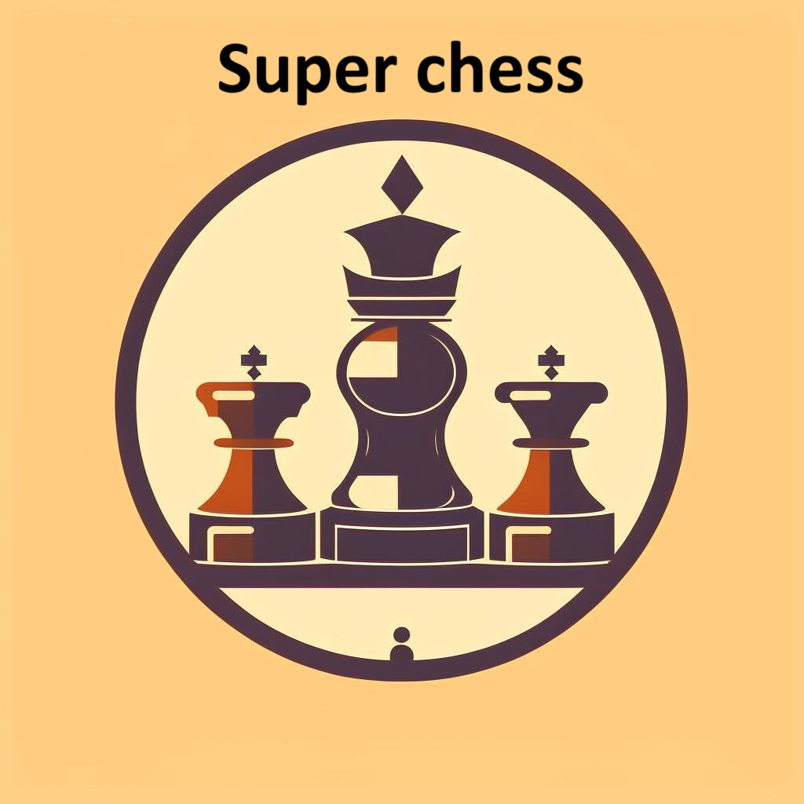

# Readmishki
[]
Супер Шахматы - это лучшая браузерная игра на свете, написанная на Python, JavaScript, HTML, CSS
## Documentation
The small documentation located here:

## Rules of the game

  
Click here

Король.

Вот король – он войском правит,
Соблюдает много правил:
Он не ходит далеко
Шаг лишь делает всего.
Встаёт рядом он на клетку,
Отдаёт приказы метко.
Лишь дебют закончит ловко
Может сделать рокировку.
А без войска остаётся,
То врагам он не сдаётся.
В рукопашную идёт,
Лично всем отпор даёт.

Ферзь.

Представляю вам ферзя –
Он помощник короля.
У него своя игра:
Под контролем вся доска.
Но вступать в бой не спешит-
За позицией следит.
После конницы, слонов
Он начать войну готов.

Конь.

Конь – коварная фигура.
У него своя натура.
Прыг да скок, и сразу в бок,
Через головы прыжок!
Делает такой кульбит-
Взвиться в небо норовит!
Вот стоял на поле белом,
Перепрыгнул между делом-
Поле чёрное под ним.
За конём следи чужим!

Слон.

Слон и воин на спине
Важны в шахматной игре.
Белопольный, чернопольный
Слон, конечно, подневольный.
Ходит он наискосок,
Делает большой бросок.
Но слонов двоих пути
Пересечься не должны.

Ладья.

А ладья – то тяжела.
Раньше башнею была.
Сверху лучник там стоит,
Королевство сторожит.
Ходит вдоль и поперёк.
Шаг ладьи тяжёл и строг.
Может сделать рокировку –
Короля упрятать ловко.
Будет домик охранять,
Часовым в дверях стоять.

Пешка.

А пехота, как всегда,
Впереди идёт она!
Пешка с пешкою плечом
Движутся всегда ладком.
Все мечтают, как одна,
Дослужиться до ферзя!
Одному лишь я не рад –
Ей нельзя ходить назад.
Ходит прямо, рубит в бок,
Не бывает ход широк.
Лишь однажды, первым ходом,
Через клетку переходит.
На проходе может сбить.
Будут знать куда ходить!

Рокировка.

Рокировку делай смело:
Шаг, ещё один шажок
Короля уводим в бок.
А теперь ладьёй шагаем,
Короля так прикрываем,
Чтобы он спокоен был –
Домик штабом послужил.

Шах и мат.

Шах и мат не путай брат.
Знает каждый – стар и млад:
Если спасся падишах-
Это будет только шах.
Если ж королю не скрыться,
Перекрыты все границы,
Значит это точно мат.
А противник будет рад!

## License
Faculty "syneprin"©
2023
